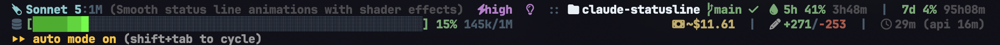

# claude-statusline

A verbose, full-width, **no-emoji**, lightly **animated** status line for
[Claude Code](https://code.claude.com/docs/en/statusline).

Two rows, left/right justified to fill the terminal:

```
Opus 4.8 (1M context):1M  eff:xhigh  think:on  ⠏ working    :: bitesize git:main clean ^1 v1  :: PR#673 OK          5h 23% 2h14m  |  7d 41% 83h20m
ctx [██████████████████████░░░░░░░░░░░░░░░░░░░░] 38% 379k/1M                                          ~$1283.62  |  +22909/-967  |  25h11m (api 8h03m)
```

Actual render (Nerd Font icons, `auto mode` footer badge is Claude Code's, not ours):



- **Row 1** — model + context-window size (`1M`/`200k`), reasoning effort, thinking
  state, output style, session name; then repo, git branch, working-tree state
  (`+staged ~modified ?untracked` or `clean`), ahead/behind (`^ v`), and open-PR
  number with review state (`OK` / `CHANGES` / `DRAFT` / `REVIEW`). Rate limits on
  the right.
- **Row 2** — a context-usage bar (color-coded, scales to terminal width) with % and
  token count; cost estimate, lines changed, and durations on the right.

### Animation: state flips only — the bar never moves

Claude Code renders the status line at most **once per second** (see
[below](#why-the-animation-updates-once-per-second)). At that rate any *motion* —
sweeps, waves, pulses — doesn't read as animation, it reads as broken rendering.
So the context bar **never animates**. Instead it has a static **shine**: the last
cells of the fill step up through brighter shades of the *same hue* (256-color
when supported), so the bar reads as lit and glossy while rendering byte-identical
every tick.

What does animate are discrete **state flips**, which look fine at 1 fps:

- **Spinner** — `⠋⠙⠹…` next to the model while the API is actively responding
  (detected by watching `total_api_duration_ms` advance between ticks).
- **Warn blink** — context ≥90%, rate limit ≥90%, and "changes requested" blink.
- **Marquee** *(opt-in)* — the right rail of row 2 cycles through
  cost → lines → durations → tokens, one per tick.
- **Separators** *(opt-in)* — the `::` / `|` separators cycle subtly.

## Honest about cost

`cost.total_cost_usd` is a **client-side estimate**, not your bill — shown as `~$…`.
The real budget signal on a Pro/Max subscription is `rate_limits` (5h + 7d windows
with reset countdowns), which the API only sends to subscribers. When absent (API
auth), the status line says so rather than faking a number.

## Install

One line, no clone needed — the installer downloads `statusline.sh` for you:

```bash
curl -fsSL https://raw.githubusercontent.com/HarzerHeribert/claude-statusline/main/install.sh | bash
```

Pass flags after `--`, or env vars before `bash`:

```bash
curl -fsSL .../install.sh | bash -s -- --no-nerd   # skip the Nerd Font
curl -fsSL .../install.sh | REFRESH=5 bash          # slower tick
```

Or clone and run it locally (identical behavior; uses the local script instead
of downloading):

```bash
git clone https://github.com/HarzerHeribert/claude-statusline.git
cd claude-statusline
./install.sh
```

The installer copies `statusline.sh` to `~/.claude/`, backs up your
`settings.json`, and wires up the `statusLine` block with `refreshInterval: 1`
(the fastest allowed — cheap, since unchanged ticks skip `jq`/`git` and an idle
bar renders identically). It appears on your next interaction with Claude Code.

```bash
REFRESH=5 ./install.sh     # slower tick, if you want it even lighter
./install.sh --dry-run     # show changes, do nothing
./install.sh --uninstall   # remove the statusLine block (keeps the script)
```

### Platform support

Works on **Linux** (all major distros), **macOS**, and **Windows** via Git Bash
or WSL.

Minimal prerequisites: `bash`, `jq`, and `git`, plus `curl` or `wget` when the
installer needs to download files. The installer keeps this minimal and will
install missing prerequisites for you when it finds a supported package manager:

| Platform / manager        | Used for missing prerequisites                    |
| ------------------------- | ------------------------------------------------- |
| Debian / Ubuntu           | `apt-get install jq git curl/wget unzip fontconfig` |
| Fedora / RHEL             | `dnf` / `yum install ...`                         |
| Arch                      | `pacman -S ...`                                   |
| openSUSE                  | `zypper install ...`                              |
| Alpine                    | `apk add ...`                                     |
| macOS                     | `brew install ...` or `port install ...`          |
| Windows                   | `choco`, `winget`, `scoop`, or Git Bash `pacman`  |

If no supported package manager is detected, it prints official download links
for the missing tool (`jq`, `git`, `curl`/`wget`, `unzip`, or `fontconfig`) and
stops before changing your Claude config.

The Nerd Font is **optional** — without one the status line uses a readable
ASCII/Unicode fallback everywhere (see [Nerd Font icons](#nerd-font-icons)).

## Preview it without a session

```bash
./demo.sh        # live render in your terminal (Ctrl-C to quit)
```

The demo cycles ~5 s "active" (payload changing → spinner runs, numbers move) and
~7 s idle (payload frozen → everything holds perfectly still), so you can see
both states.

## Configuration

Set these as env vars (e.g. inside the `command` in `settings.json`, or your shell
profile):

| Var             | Default | Meaning                                             |
| --------------- | ------- | --------------------------------------------------- |
| `CCSL_ANIM`     | `1`     | master switch for the state-flip animations         |
| `CCSL_SPINNER`  | `1`     | spinner while API is busy                            |
| `CCSL_SHINE`    | `1`     | static same-hue gloss at the fill edge (never moves) |
| `CCSL_WARN_ANIM`| `1`     | blink high context/rate-limit + "changes requested"  |
| `CCSL_SEP_ANIM` | `0`     | animate the `::` / `\|` separators (subtle)           |
| `CCSL_MARQUEE`  | `0`     | cycle the right rail of row 2 (off = show all)       |
| `CCSL_DECOUPLE` | `1`     | skip jq/git on unchanged ticks (cache parsed data)   |
| `CCSL_DATA_TTL` | `5`     | max seconds to trust the data snapshot               |
| `CCSL_GIT_TTL`  | `2`     | seconds to cache git state between animation ticks    |
| `CCSL_REFRESH`  | `10`    | must match `refreshInterval` for frame timing        |
| `CCSL_BAR_MAX`  | `60`    | max context-bar width, chars                          |
| `CCSL_COLOR`    | `1`     | colored output (`0` = plain)                          |
| `CCSL_COLOR256` | `auto`  | 256-color ramp for the shine when supported          |
| `CCSL_ASCII`    | `0`     | `1` = ASCII bar (`#`/`-`) + `\|/-\` spinner           |
| `CCSL_NERD`     | `auto`  | `auto` detect a Nerd Font, `1` force icons, `0` off   |
| `CCSL_MARGIN`   | `6`     | columns reserved at the right edge (anti-clip)        |

### Nerd Font icons

With a [Nerd Font](https://nerdfonts.com) installed and selected in your terminal,
the status line shows glyphs instead of text labels:

```
 Opus 4.8:1M   high    ::  bitesize  main   1  1  ::   673 OK
 [███████░░░] 13% 128k/1M                        ~$16.52  |   +830/-107  |   17m
```

`CCSL_NERD=auto` (default) uses icons only when a Nerd Font is detected, so it's
safe on machines without one — it falls back to `eff:high`, `git:main`, `↑1 ↓1`,
`PR#673`, etc. The installer can install **JetBrainsMono Nerd Font** for you:

```bash
./install.sh --nerd      # install the font + force icons on
./install.sh --no-nerd   # skip the font, use the ASCII/Unicode fallback
./install.sh             # detects a font; if none, offers to install it
```

How the font gets installed per platform:

- **macOS** — `brew install --cask font-jetbrains-mono-nerd-font` (falls back to
  a direct download into `~/Library/Fonts` if Homebrew is absent).
- **Linux** — the distro package where one exists (`ttf-jetbrains-mono-nerd` on
  Arch), otherwise a direct download into `~/.local/share/fonts` + `fc-cache`.
  Package-manager installs use `sudo` when needed.
- **Windows (Git Bash)** — downloads the `.ttf`s into your per-user font dir;
  Windows may still ask you to confirm the install (right-click → Install). Under
  WSL, the Linux path is used.

Requires `unzip` and `curl`/`wget` for the direct-download path; if either is
missing the installer prints manual instructions instead.

After installing, **set your terminal profile's font** to the Nerd Font (e.g.
"JetBrainsMono Nerd Font") — the shell can't switch the terminal font for you.

> **The font must be selected in whatever actually draws the terminal.** Installing
> the font is not enough; each terminal app, multiplexer, or wrapper has its own font
> setting that has to point at the Nerd Font:
>
> - **Warp** — Settings (`Cmd+,`) → Appearance → Text → *Terminal font*
> - **iTerm2** — Settings → Profiles → Text → *Font*
> - **Apple Terminal** — Settings → Profiles → Text → *Font*
> - **VS Code / Cursor integrated terminal** — set `"terminal.integrated.fontFamily": "JetBrainsMono Nerd Font"`
> - **Windows Terminal** — Settings → your profile → Appearance → *Font face* (this also covers WSL)
> - **GNOME Terminal / Konsole** — Preferences → Profile → *Custom font*
> - **Alacritty / Kitty / WezTerm** — set the font family in their config file
> - **tmux / screen** — these don't draw glyphs themselves, but they can mangle
>   wide/PUA glyphs; make sure the *outer* terminal uses the Nerd Font
>
> If icons show as blank cells or boxes, the drawing layer isn't using the Nerd Font
> yet. Prefer the plain `JetBrainsMono Nerd Font` variant over the `…Mono`/`…Propo`
> variants — the `Mono` variant squeezes icons into a narrow cell and can clip them.

## Animation is decoupled from data

Claude Code sends the JSON payload on stdin and only changes it when real data
changes. So the script splits into two phases:

1. **Data** — hash stdin; if it matches the last snapshot (and the snapshot is
   younger than `CCSL_DATA_TTL`), reuse the cached parsed values and **skip `jq`
   and `git` entirely.** Otherwise parse with `jq`, gather git state, and write a
   fresh snapshot.
2. **Animation** — always runs, but it's pure arithmetic off a wall-clock frame
   counter (`epoch / refreshInterval`). No subprocesses.

The result: a tick where nothing changed is just a `cksum` + a `source` + string
math. Every state flip (spinner, warn-blink, marquee, separators) is
**width-invariant** — it only changes colors or swaps equal-width glyphs — so the
right-aligned rail never jitters between frames.

This does **not** raise the frame rate (that's capped at 1s, see below); it makes
each frame as cheap as possible.

## Performance

The script does no network I/O and **costs zero API tokens** — Claude Code runs it
locally.

- **Unchanged tick (the common case):** no `jq`, no `git` — just a hash + reading
  the cached snapshot. **~3–8 ms.**
- **Data changed:** one `jq` parse + (on a git-cache miss) ~8 short-lived `git`
  subprocesses. **~25–45 ms.**

Measured on an Apple Silicon Mac. At `refreshInterval: 1` the idle cost is well
**under a few percent of one CPU core, and 0% while you're actively working** (the
timer is paused then). Raise `CCSL_DATA_TTL` / `CCSL_GIT_TTL` or the interval to
make it lighter still; set `CCSL_DECOUPLE=0` to always re-parse (debugging).

## Why the animation updates once per second

`refreshInterval: 1` is the **fastest Claude Code allows** — the
[docs](https://code.claude.com/docs/en/statusline) state the minimum is `1` second,
so one frame per second is the ceiling, not a choice. Two more facts worth knowing:

- Output is displayed only when the script **exits** — you can't stream frames from
  one invocation, and an in-flight run is cancelled when a new update triggers.
- Event-driven updates are debounced at 300 ms and fire on new messages, `/compact`,
  permission-mode changes, etc. — not on a smooth clock.
- The fullscreen (`/tui`) renderer makes redraws flicker-free, but does not change
  any of the above.
- **Plugins can't change this either** — plugins add skills, hooks, MCP servers and
  agents; none of that touches the TUI renderer or the status-line contract.

That 1 fps ceiling is exactly why the bar doesn't animate at all: motion at 1 fps
reads as broken rendering, while discrete state flips (spinner on/off, a blink, a
segment swap) read as intended. Set `CCSL_ANIM=0` to turn the state flips off too.

Example — static, ASCII, no color:

```json
{
  "statusLine": {
    "type": "command",
    "command": "CCSL_ANIM=0 CCSL_ASCII=1 CCSL_COLOR=0 ~/.claude/statusline.sh",
    "refreshInterval": 10
  }
}
```

## How it works

Claude Code pipes [session JSON](https://code.claude.com/docs/en/statusline#available-data)
to the script on stdin; the script prints two lines to stdout. It reads `COLUMNS`
(set by the harness) for terminal width, uses `jq` to parse the payload, and caches
one integer per session under `$TMPDIR` for spinner busy-detection. No network, no
token cost.

## License

MIT — see [LICENSE](LICENSE).
